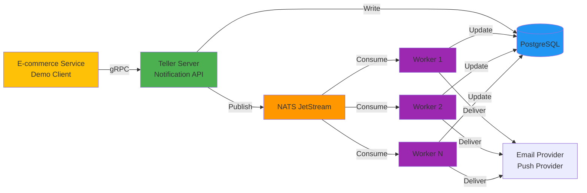

# TellTheWorld 📢

[](https://golang.org/)
[](LICENSE)
[](docs/ARCHITECTURE.md)

## 🏗️ Architecture



**Architecture Pattern**: Producer-Consumer with Event-Driven Processing

- **E-commerce Service**: Demo client simulating e-commerce events (Chat, Purchase, Payment, Shipping)
- **Teller Server**: API layer accepting notification requests via gRPC
- **Event Broker**: NATS JetStream for asynchronous message delivery
- **Workers**: Consumer pool processing and delivering notifications to external providers
- **Database**: PostgreSQL for persistence and state management

📖 **[Read Full Architecture Documentation →](docs/ARCHITECTURE.md)**

## 🚀 Quick Start

Get up and running in under 5 minutes!

### Prerequisites

- **Docker** or **Podman** - Container runtime
- **Docker Compose** or **podman-compose**
- `curl` and `jq` for testing
- `grpcurl` for API interaction

### 3-Step Setup

1. **Clone the repository**
   ```bash
   git clone https://github.com/toeydevelopment/telltheworld.git
   cd telltheworld
   ```

2. **Start all services**
   ```bash
   # Using Podman (recommended)
   ./scripts/podman-up.sh

   # Or using Docker
   docker-compose up -d
   ```

3. **Verify everything is running**
   ```bash
   # Check services
   podman ps

   # Health checks
   curl http://localhost:8222/healthz  # NATS
   ```

### Send Your First Notification

```bash
# Install grpcurl
go install github.com/fullstorydev/grpcurl/cmd/grpcurl@latest

# Send a notification
grpcurl -plaintext -d '{
  "notification": {
    "title": "Welcome!",
    "body": "Thanks for trying TellTheWorld",
    "ref_id": "welcome-001"
  },
  "destinations": [
    {
      "channel": 2,
      "destination": "user@example.com"
    }
  ]
}' localhost:9000 teller.v1.NotificationService/SendToUser
```

**Response:**
```json
{
  "notificationId": "01HN3X2Z8K9J6Y5P4Q3M2N1R0S"
}
```

📖 **[Complete Quick Start Guide →](docs/QUICK_START.md)** - Includes detailed setup, testing, and troubleshooting

## 📚 Documentation

| Document | Description |
|----------|-------------|
| [Quick Start Guide](docs/QUICK_START.md) | Get up and running in 5 minutes with Docker Compose |
| [Architecture](docs/ARCHITECTURE.md) | System architecture, components, and design decisions |
| [CLAUDE.md](CLAUDE.md) | Development guide for AI-assisted coding |
| [API Reference](apis/) | gRPC and HTTP API documentation |

## 🎯 E-commerce Event Examples

The system handles these specific e-commerce notification scenarios:

### 1. Chat Message (Buyer → Seller)
```bash
# Seller receives notification when buyer sends a message
grpcurl -plaintext -d '{
  "notification": {
    "title": "New message from buyer",
    "body": "Hi, is this item still available?",
    "ref_id": "chat-msg-12345"
  },
  "destinations": [
    {"channel": 2, "destination": "seller@shop.com"},
    {"channel": 1, "destination": "seller-device-token"}
  ]
}' localhost:9000 teller.v1.NotificationService/SendToUser
```

### 2. Purchase Confirmation (Buyer Completes Purchase)
```bash
# Seller receives notification of new purchase
grpcurl -plaintext -d '{
  "notification": {
    "title": "New Order #12345",
    "body": "Customer purchased 2x Premium Widget ($99.00)",
    "ref_id": "order-12345"
  },
  "destinations": [
    {"channel": 2, "destination": "seller@shop.com"},
    {"channel": 1, "destination": "seller-device-token"}
  ]
}' localhost:9000 teller.v1.NotificationService/SendToUser
```

### 3. Payment Reminder (Pending Payment Deadline)
```bash
# Buyer receives reminder about pending payment
grpcurl -plaintext -d '{
  "notification": {
    "title": "Payment Reminder",
    "body": "Your payment for Order #12345 is due in 24 hours",
    "ref_id": "payment-reminder-12345",
    "schedule_at": "2025-01-16T10:00:00Z"
  },
  "destinations": [
    {"channel": 1, "destination": "buyer-device-token"}
  ]
}' localhost:9000 teller.v1.NotificationService/SendToUser
```

### 4. Shipping Update (Items Shipped)
```bash
# Buyer receives shipping notification
grpcurl -plaintext -d '{
  "notification": {
    "title": "Your order has shipped!",
    "body": "Order #12345 is on the way. Track: TRK123456789",
    "ref_id": "shipping-12345"
  },
  "destinations": [
    {"channel": 1, "destination": "buyer-device-token"}
  ]
}' localhost:9000 teller.v1.NotificationService/SendToUser
```

### 5. Demo E-commerce Service

The included **ecommerce service** is a demo client that simulates all these events:

```bash
# Access the demo e-commerce API
curl http://localhost:8080/health

# The service will automatically trigger notification events
# Check scripts/test-ecommerce*.sh for examples
./scripts/test-ecommerce-all.sh
```

## 🛠️ Development

### Project Structure

```
telltheworld/
├── apps/                    # Microservice applications
│   ├── teller/             # Notification service
│   │   ├── cmd/            # Entry points (server, worker)
│   │   ├── internal/       # Private application code
│   │   │   ├── biz/        # Business logic
│   │   │   ├── data/       # Data access layer
│   │   │   ├── service/    # gRPC/HTTP handlers
│   │   │   └── server/     # Server configuration
│   │   └── config/         # Configuration files
│   └── ecommerce/          # E-commerce service
├── apis/                   # Protocol Buffer definitions
│   ├── teller/v1/          # Teller API specs
│   └── ecommerce/v1/       # E-commerce API specs
├── pkg/                    # Shared packages
│   ├── wpubsub/            # Pub/sub abstraction
│   ├── wgorm/              # GORM utilities
│   ├── wemail/             # Email utilities
│   └── wid/                # ID generation
├── internal/               # Shared internal packages
│   └── wkratos/            # Kratos framework utilities
├── scripts/                # Operational scripts
├── deploy/                 # Deployment configurations
└── docs/                   # Documentation
```

### Common Commands

```bash
# Generate all code (from root)
make api                    # Generate proto APIs for all apps
make wire                   # Generate dependency injection
make genmocks               # Generate test mocks

# Per-app commands (cd apps/teller)
make build                  # Build binaries
make test                   # Run all tests
make run                    # Run server locally

# Testing
go test ./internal/biz -v              # Unit tests
go test ./internal/biz -v -cover       # With coverage
./scripts/test-grpc.sh                 # Integration tests

# Code generation
make grpc                   # Generate gRPC code
make http                   # Generate HTTP gateway
make swagger                # Generate API docs
```

### Running Locally (Without Containers)

1. **Start infrastructure**
   ```bash
   # Start only PostgreSQL and NATS
   podman-compose up postgres nats
   ```

2. **Update configuration**
   ```bash
   # Edit apps/teller/config/config.yaml
   # Change database host from "postgres" to "localhost"
   ```

3. **Run server**
   ```bash
   cd apps/teller
   make run
   ```

4. **Run worker (in another terminal)**
   ```bash
   cd apps/teller
   go run cmd/worker/main.go -conf config/config.yaml
   ```

## 🧪 Testing

### Unit Tests

```bash
cd apps/teller

# Run all tests
go test ./... -v

# Run with coverage
go test ./internal/biz -coverprofile=coverage.out
go tool cover -html=coverage.out

# Run specific test
go test ./internal/biz -v -run TestNotification_SendToUser
```

### Integration Tests

```bash
# Start all services first
./scripts/podman-up.sh

# Run gRPC integration tests
./scripts/test-grpc.sh

# Run comprehensive tests
./scripts/test-podman.sh
```

### Load Testing

```bash
# Test with multiple concurrent requests
./scripts/test-ecommerce-load.sh

# Test error scenarios
./scripts/test-ecommerce-errors.sh
```

## 📊 API Reference

### NotificationService

#### SendToUser
Send a notification to specific destinations.

**Request:**
```protobuf
message SendToUserRequest {
  Notification notification = 1;
  repeated ChannelDestination destinations = 2;
}
```

**Response:**
```protobuf
message WillPushReply {
  string notification_id = 1;
}
```

#### BulkSendToUser
Send multiple notifications in one request.

**Request:**
```protobuf
message BulkSendToUserRequest {
  repeated SendToUserRequest requests = 1;
}
```

#### GetNotificationStatus
Retrieve notification delivery status.

**Request:**
```protobuf
message GetNotificationStatusRequest {
  string notification_id = 1;
}
```

**Response:**
```protobuf
message GetNotificationStatusReply {
  repeated StatusPerChannel statuses = 1;
}
```

### Channels

| Channel | Value | Description |
|---------|-------|-------------|
| Push | 1 | Mobile push notifications (FCM, APNS) |
| Email | 2 | Email delivery via SMTP |
| SMS | 3 | SMS via Twilio/etc (coming soon) |
| Webhook | 4 | HTTP webhook calls (coming soon) |

### Status Codes

| Status | Description |
|--------|-------------|
| Pending | Awaiting processing |
| Sent | Successfully delivered |
| Failed | Delivery failed after retries |

## 🔧 Configuration

### Environment Variables

```bash
# Server
SERVER_HTTP_ADDR=0.0.0.0:8000
SERVER_GRPC_ADDR=0.0.0.0:9000

# Database
DATA_DATABASE_HOST=postgres
DATA_DATABASE_PORT=5432
DATA_DATABASE_USERNAME=postgres
DATA_DATABASE_PASSWORD=password
DATA_DATABASE_DB=telltheworld

# PubSub (choose one)
PUBSUB_TYPE=nats              # nats, redis, or kafka
PUBSUB_NATS_URL=nats://nats:4222
PUBSUB_REDIS_URL=redis://redis:6379
PUBSUB_BROKERS=kafka:29092

# Worker
WORKER_STUCK_THRESHOLD=5m     # Time before notification considered stuck
WORKER_MAX_ATTEMPTS=5         # Max retry attempts
```

### Switching Event Brokers

```bash
# Use Redis instead of NATS
./scripts/podman-up.sh --redis

# Use Kafka
./scripts/podman-up.sh --kafka
```

## 🚢 Deployment

### Container Deployment

```bash
# Production deployment with Podman
./scripts/podman-up.sh

# Scale workers
podman-compose up --scale teller-worker=5

# View service health
podman ps
podman logs -f teller-server
```

### Kubernetes (Coming Soon)

```bash
# Apply Helm chart
helm install telltheworld ./deploy/helm

# Scale workers
kubectl scale deployment teller-worker --replicas=10
```

## 📈 Monitoring

### Health Checks

```bash
# NATS monitoring
curl http://localhost:8222/healthz
curl http://localhost:8222/jsz | jq   # JetStream info

# Database
podman exec teller-postgres pg_isready

# Application logs
podman logs -f teller-server
podman logs -f teller-worker-1
```

### Database Queries

```sql
-- Check notification status distribution
SELECT status, COUNT(*) FROM notifications GROUP BY status;

-- View recent notifications
SELECT notification_id, title, status, created_at
FROM notifications
ORDER BY created_at DESC
LIMIT 10;

-- Check worker distribution
SELECT processing_worker_id, COUNT(*) as assigned
FROM notifications
WHERE status = 'processing'
GROUP BY processing_worker_id;

-- Find stuck notifications
SELECT notification_id, processing_started_at, processing_worker_id
FROM notifications
WHERE status = 'processing'
AND processing_started_at < NOW() - INTERVAL '5 minutes';
```

## 🔍 Troubleshooting

### Workers Not Processing Notifications

**Symptom**: Notifications stuck in `pending` status

**Solutions**:
1. Check worker logs: `podman logs teller-worker-1`
2. Verify NATS connection: `curl http://localhost:8222/connz`
3. Check database connectivity from worker container
4. Verify NATS stream exists: `curl http://localhost:8222/jsz | jq`

### Database Connection Errors

**Symptom**: `connection refused` errors

**Solutions**:
1. Use service name (`postgres`) not `localhost` in containers
2. Check connection pool settings
3. Verify PostgreSQL is running: `podman ps | grep postgres`

### NATS Consumer Errors

**Symptom**: `invalid consumer name` errors

**Solution**: Consumer names are sanitized automatically (dots/dashes → underscores)

### Notification Stuck in Processing

**Symptom**: Status shows `processing` for too long

**Solution**: Workers automatically recover stuck notifications after 5 minutes
