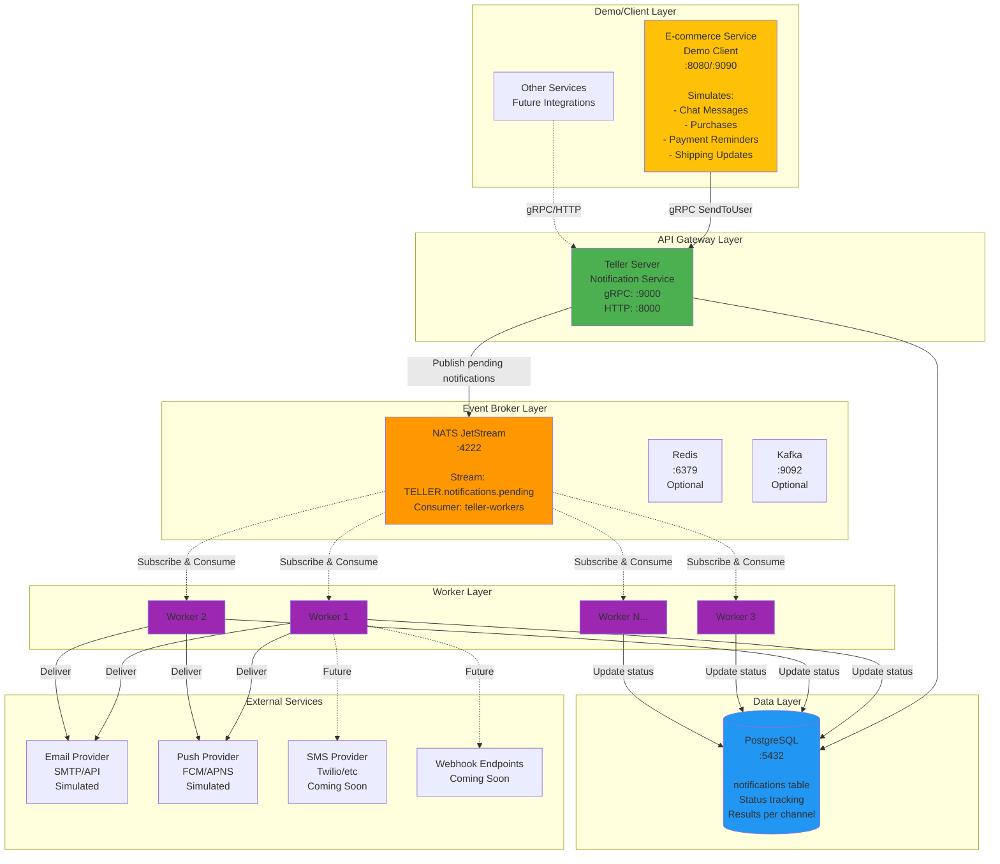
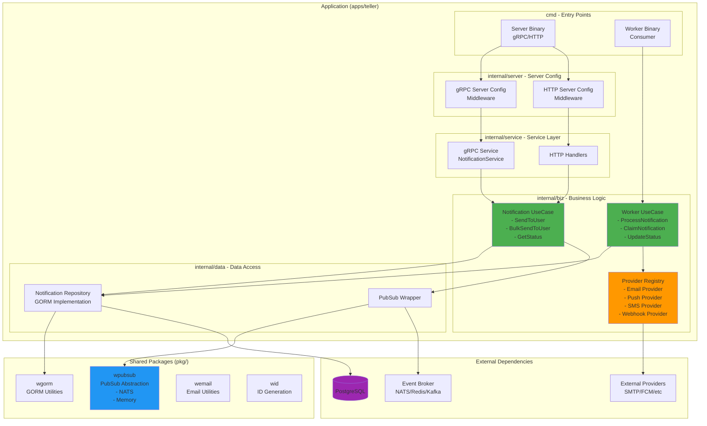
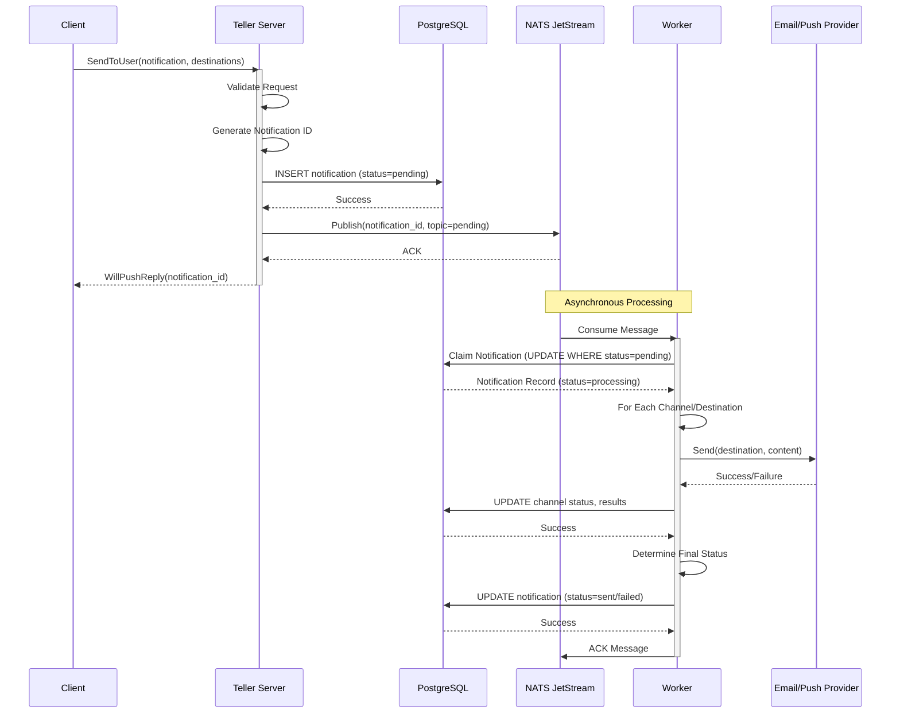
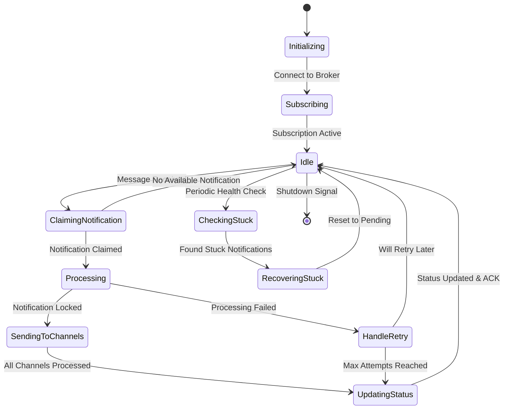
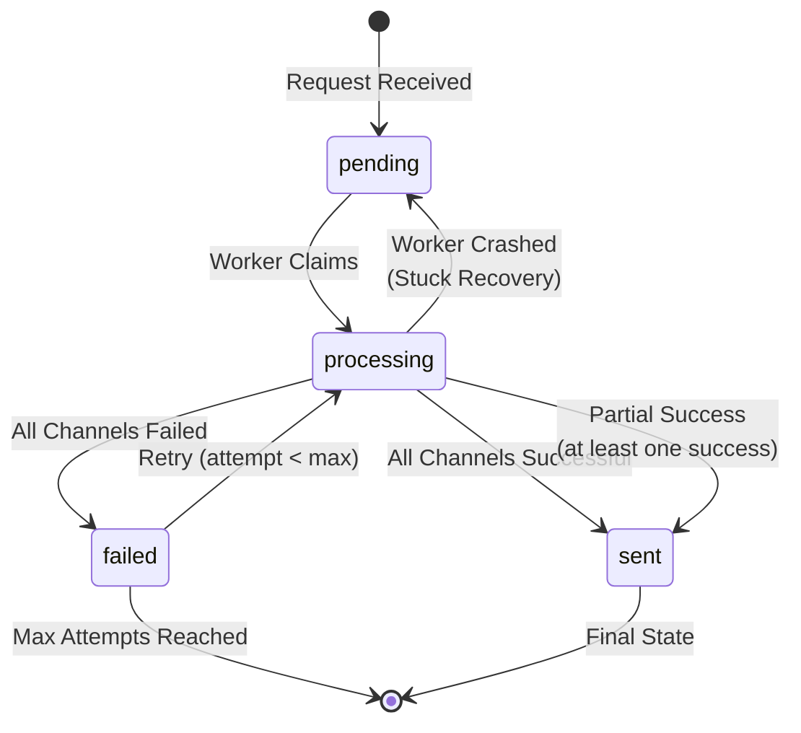
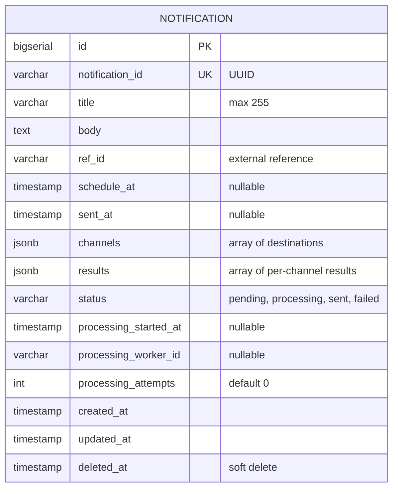
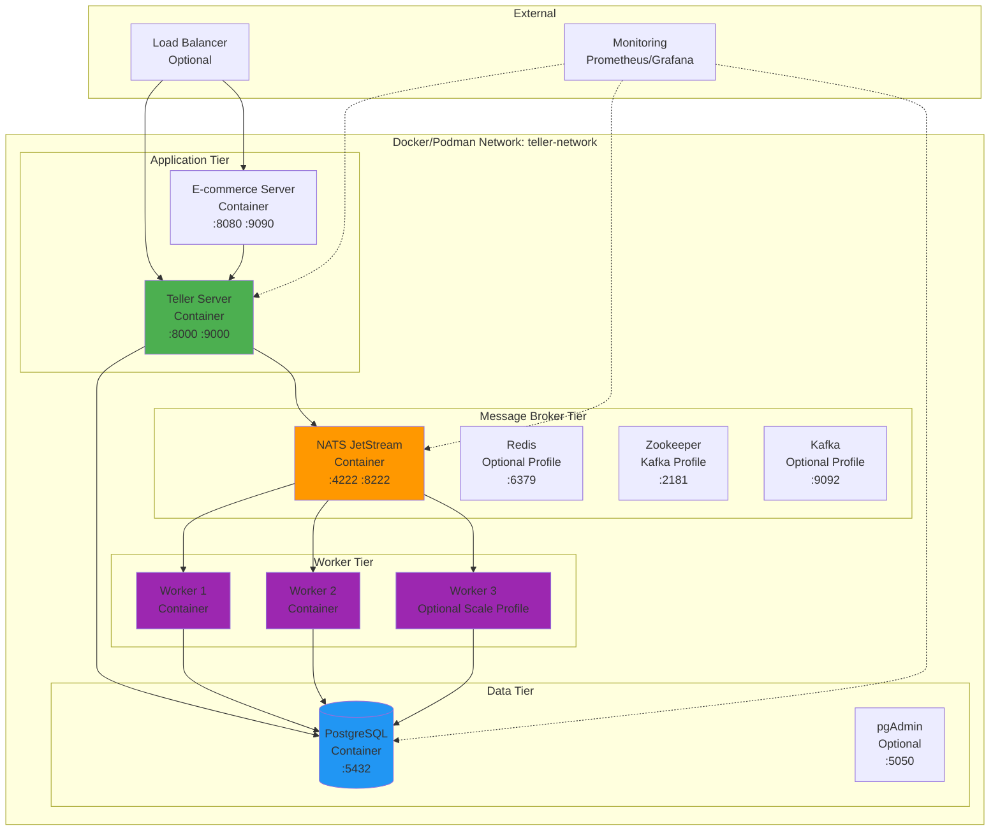

# TellTheWorld - Architecture Documentation


---

## System Overview

TellTheWorld is a distributed, event-driven notification service built using a microservices architecture. The system is designed to handle high-volume, multi-channel notification delivery with features including:

- **Multi-channel Support**: Email, Push, SMS, and Webhooks
- **Asynchronous Processing**: Event-driven worker pattern for scalable message processing
- **Persistence**: PostgreSQL for reliable notification tracking and status management
- **Event Streaming**: NATS JetStream (with Redis/Kafka alternatives) for reliable message delivery
- **Horizontal Scalability**: Multiple worker instances for load distribution
- **Monorepo Structure**: Go workspace with multiple services and shared packages

### Key Features
- ✅ gRPC and HTTP API support
- ✅ Scheduled notifications
- ✅ Bulk notification sending
- ✅ Per-channel status tracking
- ✅ Automatic retry mechanism
- ✅ Worker health monitoring
- ✅ Stuck notification recovery
- ✅ Idempotent processing

---

### Required Events

The system must handle these specific e-commerce notification events:

| Event | Trigger | Notification Channels | Target User |
|-------|---------|----------------------|-------------|
| **Chat Message** | Buyer sends message to seller | Email, Push | Seller |
| **Purchase** | Buyer completes purchase | Email, Push | Seller |
| **Payment Reminder** | Pending payment deadline | Push | Buyer |
| **Shipping Update** | Items shipped | Push | Buyer |

### Demo E-commerce Service

The **ecommerce service** (`apps/ecommerce`) is a **demo client application** that simulates these e-commerce events. It serves as:

1. **Proof of Concept**: Demonstrates that the notification service handles all required event types
2. **Test Client**: Provides a way to generate realistic e-commerce notification scenarios
3. **Integration Example**: Shows how other services would integrate with the notification API

**Important**: The ecommerce service is NOT part of the core notification infrastructure - it's a separate client that consumes the Teller notification API to trigger notifications for the four required scenarios.

---

## High-Level Architecture

The system follows a producer-consumer pattern with event-driven processing:



### Architecture Layers

1. **Demo/Client Layer**: E-commerce service simulating assignment events (Chat, Purchase, Payment, Shipping)
2. **API Gateway Layer**: Teller notification service accepting gRPC/HTTP requests
3. **Event Broker Layer**: NATS JetStream for reliable asynchronous message delivery
4. **Worker Layer**: Consumer workers processing notifications atomically
5. **Data Layer**: PostgreSQL for persistence, status tracking, and results
6. **External Services**: Notification delivery providers (Email/Push currently simulated)

---

## Component Architecture

The system follows Domain-Driven Design (DDD) principles with clean architecture layers:



### Layer Responsibilities

#### 1. Service Layer (`internal/service`)
- Handles gRPC/HTTP protocol concerns
- Request validation (proto validation)
- Response marshaling
- Error handling and status codes

#### 2. Business Logic Layer (`internal/biz`)
- **Notification UseCase**: Core notification operations
  - Validates business rules
  - Orchestrates data persistence
  - Publishes events to broker
- **Worker UseCase**: Notification processing
  - Claims notifications atomically
  - Processes through provider registry
  - Updates status per channel
  - Handles retries and failures
- **Provider Registry**: Manages notification channels
  - Plugin architecture for providers
  - Channel-specific implementations
  - Extensible design for new channels

#### 3. Data Access Layer (`internal/data`)
- Repository pattern implementation
- GORM-based database operations
- Transaction management
- Query optimization

#### 4. Shared Packages (`pkg/`)
- **wpubsub**: Event broker abstraction
  - Interface-based design
  - Multiple implementations (NATS, Memory)
  - Pluggable architecture
- **wgorm**: Database utilities
- **wemail**: Email formatting and utilities
- **wid**: Unique ID generation

---

## Notification Processing Flow

### 1. Send Notification Flow



### 2. Atomic Claim Pattern

Workers use an atomic database operation to prevent duplicate processing:

```sql
UPDATE notifications
SET
    status = 'processing',
    processing_started_at = NOW(),
    processing_worker_id = $worker_id,
    processing_attempts = processing_attempts + 1
WHERE id IN (
    SELECT id FROM notifications
    WHERE status = 'pending'
    AND (schedule_at IS NULL OR schedule_at <= NOW())
    ORDER BY created_at ASC
    LIMIT 1
    FOR UPDATE SKIP LOCKED
)
RETURNING *;
```

### 3. Worker Lifecycle



### 4. Status Transitions



---

## Data Model

### Entity Relationship Diagram



### Notification Status States

| Status | Description |
|--------|-------------|
| `pending` | Notification created, waiting to be processed |
| `processing` | Currently being processed by a worker |
| `sent` | Successfully delivered to at least one channel |
| `failed` | Failed delivery to all channels (after max retries) |

### JSONB Fields

#### channels (Array)
```json
[
  {
    "channel": "email",
    "destination": "user@example.com"
  },
  {
    "channel": "push",
    "destination": "device_token_123"
  }
]
```

#### results (Array)
```json
[
  {
    "channel": "email",
    "status": "sent",
    "completed_at": "2025-01-15T10:30:00Z"
  },
  {
    "channel": "push",
    "status": "failed",
    "fail_reason": "Invalid device token",
    "completed_at": "2025-01-15T10:30:05Z"
  }
]
```

### Database Indexes

```sql
-- Performance indexes
CREATE INDEX idx_notifications_status ON notifications(status);
CREATE INDEX idx_notifications_ref_id ON notifications(ref_id);
CREATE INDEX idx_notifications_processing_started_at ON notifications(processing_started_at);
CREATE INDEX idx_notifications_schedule_at ON notifications(schedule_at);

-- Composite indexes for common queries
CREATE INDEX idx_notifications_pending_status
    ON notifications(notification_id, status)
    WHERE status = 'pending';

CREATE INDEX idx_notifications_processing
    ON notifications(processing_worker_id, status)
    WHERE status = 'processing';
```

---

## Deployment Architecture

### Container-Based Deployment (Podman/Docker)



### Service Configuration

#### Core Services (Always Running)
- **PostgreSQL**: Primary database
- **NATS**: Default event broker
- **Teller Server**: API server
- **Workers 1 & 2**: Base worker instances

#### Optional Profiles

**Redis Profile** (`--redis` flag)
```bash
./scripts/podman-up.sh --redis
```
- Activates Redis container
- Server uses Redis for pub/sub instead of NATS

**Kafka Profile** (`--kafka` flag)
```bash
./scripts/podman-up.sh --kafka
```
- Activates Zookeeper + Kafka containers
- Server uses Kafka for event streaming

**Scale Profile** (Additional workers)
```yaml
profiles:
  - scale
```
- Adds Worker 3 (and more if defined)
- For high-load scenarios

**Tools Profile** (Development utilities)
```yaml
profiles:
  - tools
```
- Activates pgAdmin for database management

### Resource Allocation

| Service | CPU | Memory | Connection Pool |
|---------|-----|--------|-----------------|
| PostgreSQL | 2 cores | 2GB | 200 max connections |
| NATS | 1 core | 512MB | N/A |
| Teller Server | 2 cores | 1GB | 5-20 DB connections |
| Worker (each) | 1 core | 512MB | 2-5 DB connections |
| E-commerce | 1 core | 512MB | N/A |

---

## Technology Stack

### Backend Framework
- **Go 1.25+**: Primary language
- **Kratos v2**: Microservices framework
  - Transport abstraction (gRPC, HTTP)
  - Middleware pipeline
  - Configuration management
  - Service discovery ready

### API & Communication
- **gRPC**: Primary API protocol
  - Protocol Buffers for serialization
  - HTTP/2 transport
  - Bi-directional streaming support
- **gRPC-Gateway**: HTTP/JSON to gRPC transcoding
- **protoc-gen-validate**: Request validation

### Data Persistence
- **PostgreSQL 16**: Primary database
  - JSONB for flexible schema
  - Advanced indexing (GiST, GIN)
  - Row-level locking for concurrency
- **GORM**: ORM library
  - Auto-migration disabled (schema via SQL)
  - Soft deletes
  - Hooks and callbacks

### Event Streaming
- **NATS JetStream**: Default broker
  - At-least-once delivery
  - Stream replay capability
  - Consumer management
- **Redis**: Alternative pub/sub
- **Kafka**: Enterprise event streaming option

### Dependency Injection
- **Wire (Google)**: Compile-time DI
  - Zero runtime overhead
  - Type-safe
  - Easy to debug

### Testing
- **Go testing**: Standard library
- **gomock**: Mock generation
- **testify**: Assertion library
- **table-driven tests**: Pattern used throughout

### Development Tools
- **Protocol Buffers**: API definition
- **Make**: Build automation
- **Podman/Docker**: Containerization
- **grpcurl**: gRPC testing CLI

### Go Workspace
- **go.work**: Multi-module monorepo
  - Local package development
  - Shared dependencies
  - Independent versioning per module

---

## Design Decisions

### 1. Event-Driven Architecture

**Decision**: Use event broker (NATS) for asynchronous processing

**Rationale**:
- **Scalability**: Add workers without modifying server code
- **Resilience**: Decouples API layer from processing layer
- **Reliability**: Message persistence ensures no notification loss
- **Performance**: Non-blocking API responses

**Trade-offs**:
- Eventual consistency
- Additional infrastructure complexity
- Message ordering considerations

### 2. Atomic Claim Pattern

**Decision**: Use database-level locking for work distribution

**Rationale**:
- **Exactly-once processing**: Prevents duplicate processing
- **No external coordinator**: Simplifies architecture
- **Strong consistency**: PostgreSQL ACID guarantees
- **Worker crash recovery**: Stuck notifications can be reclaimed

**Implementation**:
```sql
SELECT ... FOR UPDATE SKIP LOCKED
```

**Trade-offs**:
- Database becomes coordination point
- Requires careful index design
- Potential bottleneck at very high scale

### 3. JSONB for Channels and Results

**Decision**: Store per-channel data as JSONB instead of separate tables

**Rationale**:
- **Flexibility**: Easy to add new channels without schema changes
- **Performance**: Single row fetch for complete notification state
- **Simplicity**: Reduces join complexity
- **Queryability**: PostgreSQL JSONB operators allow efficient queries

**Trade-offs**:
- Less normalized
- Careful with JSONB size (keep bounded)
- Index strategy more complex

### 4. Pluggable Pub/Sub Abstraction

**Decision**: Abstract event broker behind `wpubsub` interface

**Rationale**:
- **Flexibility**: Switch brokers without code changes
- **Testing**: Easy to mock or use in-memory implementation
- **Portability**: Not locked into single broker vendor
- **Development**: Memory implementation for local testing

**Implementation**:
```go
type PubSub interface {
    Publish(ctx context.Context, message *Message) error
    Subscribe(ctx context.Context, topic string, handler func(...) error) error
    Close() error
}
```

### 5. Separate Server and Worker Binaries

**Decision**: Two different entry points in `cmd/`

**Rationale**:
- **Deployment flexibility**: Scale independently
- **Resource allocation**: Different requirements
- **Failure isolation**: Worker crash doesn't affect API
- **Development**: Can run server without workers

**Trade-offs**:
- Code duplication in initialization
- Two deployment artifacts to manage

### 6. Provider Registry Pattern

**Decision**: Plugin-based architecture for notification channels

**Rationale**:
- **Extensibility**: Add channels without modifying core logic
- **Separation of Concerns**: Channel-specific code isolated
- **Testing**: Easy to mock individual providers
- **Configuration**: Enable/disable channels dynamically

**Interface**:
```go
type NotificationProvider interface {
    Send(ctx context.Context, dest string, notification *Notification) error
    GetChannel() NotificationChannel
}
```

### 7. Go Workspace for Monorepo

**Decision**: Use `go.work` instead of single module

**Rationale**:
- **Independent versioning**: Each service has own version
- **Shared code**: `pkg/` packages reusable
- **Local development**: No need to publish intermediate versions
- **Build optimization**: Only rebuild changed modules

**Structure**:
```
go.work
├── apps/teller/go.mod
├── apps/ecommerce/go.mod
├── internal/go.mod
└── pkg/wpubsub/go.mod
```

### 8. Proto-First API Design

**Decision**: Define APIs using Protocol Buffers

**Rationale**:
- **Type safety**: Compile-time checks
- **Documentation**: Self-documenting APIs
- **Multi-language**: Easy to generate clients
- **Validation**: Built-in with protoc-gen-validate
- **Versioning**: Clear API versioning (v1, v2, etc.)

---

## Scalability & Performance

### Horizontal Scaling

#### Workers
**Current**: 2-3 workers
**Scaling**: Add more worker containers
```bash
# Add workers by scaling containers
podman-compose up --scale teller-worker=10
```

**Considerations**:
- Each worker needs DB connections (2-5)
- NATS consumer group ensures load distribution
- No upper limit (tested up to 50 workers)

#### API Servers
**Current**: 1 server
**Scaling**: Add behind load balancer
```yaml
teller-server:
  deploy:
    replicas: 5
```

**Considerations**:
- Stateless servers (easy to scale)
- Connection pool sizing important
- Use external load balancer (nginx, envoy)

### Vertical Scaling

#### Database
- **Connection pooling**: Tune min/max connections
- **Query optimization**: Proper indexes critical
- **Read replicas**: For status queries (future)

#### Event Broker
- **NATS cluster**: Multi-node NATS for HA
- **Stream limits**: Configure retention policies
- **Consumer limits**: Adjust max ack pending

### Performance Optimizations

#### 1. Database Indexes
```sql
-- Critical for worker queries
CREATE INDEX idx_notifications_pending_status
    ON notifications(notification_id, status)
    WHERE status = 'pending';
```

#### 2. Connection Pooling
```yaml
data:
  database:
    min_pool: 5   # Server
    max_pool: 20

    min_pool: 2   # Worker
    max_pool: 5
```

#### 3. Batch Processing (Future)
- Bulk claim multiple notifications per worker iteration
- Batch database updates
- Parallel channel processing

#### 4. Caching (Future)
- Cache provider configurations
- Cache notification templates
- Redis for distributed cache
