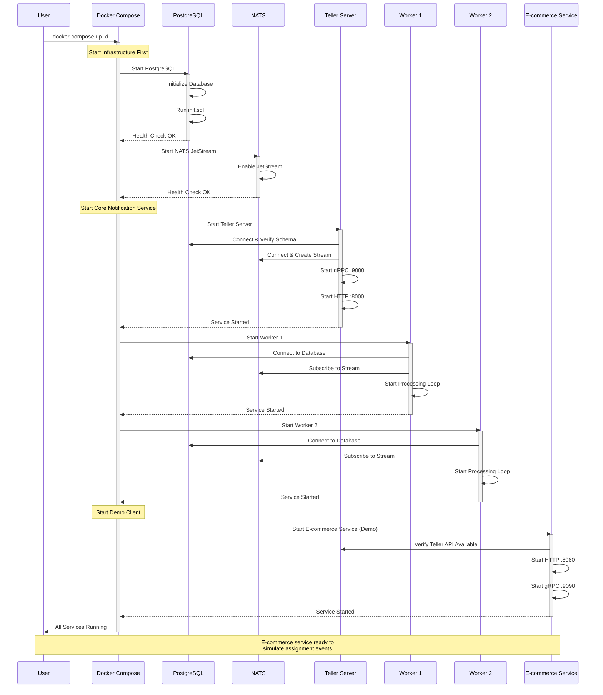
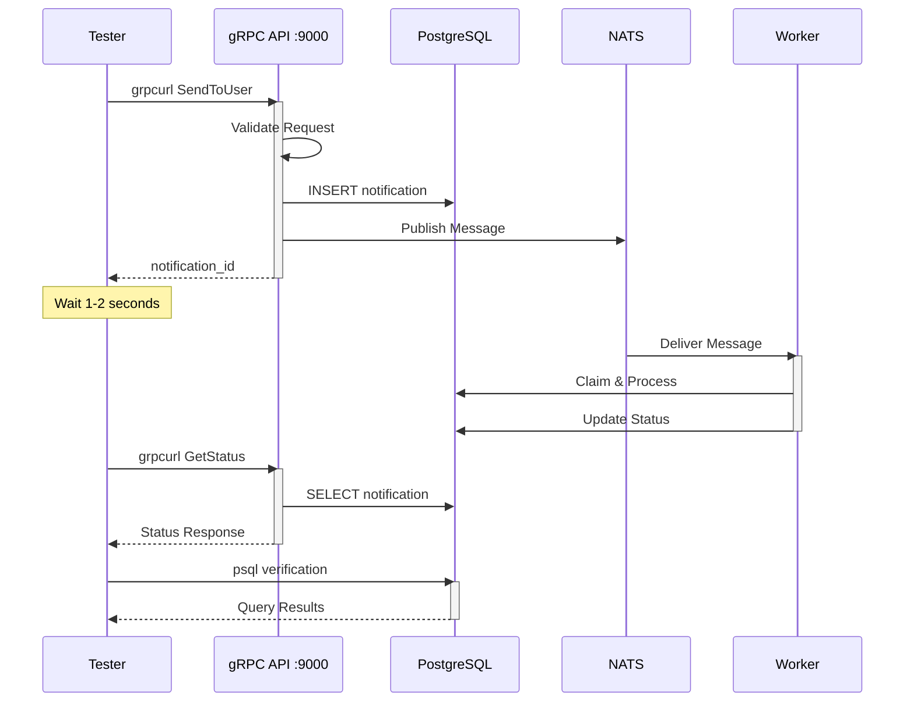

# Quick Start Guide - Docker Compose

## Prerequisites

- Docker 20.10+ or Podman 4.0+
- Docker Compose or podman-compose
- `curl` and `jq` (for testing)
- `grpcurl` (for API testing)

## Installation

### Option 1: Using Docker

```bash
# Clone the repository
git clone https://github.com/toeydevelopment/telltheworld.git
cd telltheworld

# Start all services
docker-compose up -d

# View logs
docker-compose logs -f
```

### Option 2: Using Podman (Recommended)

```bash
# Clone the repository
git clone https://github.com/toeydevelopment/telltheworld.git
cd telltheworld

# Start all services using the convenience script
./scripts/podman-up.sh

# View logs
podman-compose logs -f
```

## Architecture Overview

```mermaid
graph TB
    subgraph "Docker Compose Setup"
        subgraph "Data Services"
            PG[PostgreSQL<br/>Port: 5432<br/>Volume: postgres_data]
        end

        subgraph "Message Broker"
            NATS[NATS JetStream<br/>Client: 4222<br/>Monitor: 8222<br/>Volume: nats_data]
        end

        subgraph "Core Notification Service"
            Server[Teller Server<br/>gRPC: 9000<br/>HTTP: 8000]
            W1[Worker 1]
            W2[Worker 2]
        end

        subgraph "Demo Client"
            Ecom[E-commerce Service<br/>Demo Client<br/>HTTP: 8080<br/>gRPC: 9090<br/><br/>Simulates 4 Events:<br/>• Chat Message<br/>• Purchase<br/>• Payment Reminder<br/>• Shipping Update]
        end

        subgraph "Optional Services"
            Redis[Redis<br/>Port: 6379<br/>Profile: redis]
            Kafka[Kafka<br/>Port: 9092<br/>Profile: kafka]
            PGA[pgAdmin<br/>Port: 5050<br/>Profile: tools]
        end
    end

    Ecom -->|Calls| Server
    Server --> PG
    Server --> NATS
    W1 --> PG
    W1 --> NATS
    W2 --> PG
    W2 --> NATS

    style Ecom fill:#FFC107
    style Server fill:#4CAF50
    style PG fill:#2196F3
    style NATS fill:#FF9800
    style W1 fill:#9C27B0
    style W2 fill:#9C27B0
    style Redis fill:#DC382D
    style Kafka fill:#231F20
```



**Key Components:**
- **🟨 E-commerce Service**: Demo client simulating assignment events (NOT core infrastructure)
- **🟩 Teller Server**: Core notification API service
- **🟪 Workers**: Notification processors
- **🟦 PostgreSQL**: Persistent storage
- **🟧 NATS**: Event streaming broker

## Startup Flow



## Step-by-Step Setup

### Step 1: Start the Services

```bash
# Using Podman (recommended)
./scripts/podman-up.sh

# Or using Docker
docker-compose up -d
```

Expected output:
```
[+] Running 6/6
 ✔ Network teller-network         Created
 ✔ Container teller-postgres      Started
 ✔ Container teller-nats          Started
 ✔ Container teller-server        Started
 ✔ Container teller-worker-1      Started
 ✔ Container teller-worker-2      Started
 ✔ Container ecommerce-server     Started
```

### Step 2: Verify Services

```bash
# Check all containers are running
podman ps

# Or with Docker
docker ps
```

You should see 6 containers running:
- `teller-postgres` - Database
- `teller-nats` - Event broker
- `teller-server` - Core notification API
- `teller-worker-1` - Notification processor
- `teller-worker-2` - Notification processor
- `ecommerce-server` - Demo client for assignment events

### Step 3: Health Checks

```bash
# Check PostgreSQL
podman exec teller-postgres pg_isready -U postgres

# Check NATS
curl http://localhost:8222/healthz

# Check NATS JetStream
curl http://localhost:8222/jsz | jq '.streams'

# Check if notification stream exists
curl http://localhost:8222/jsz | jq '.stream_names'
# Should show: ["TELLER"]

# Check E-commerce service (demo client)
curl http://localhost:8080/health || echo "E-commerce service endpoint may vary"
```

### Step 4: View Logs

```bash
# View all logs
podman-compose logs -f

# View specific service logs
podman logs -f teller-server          # Core notification API
podman logs -f teller-worker-1        # Worker 1
podman logs -f teller-worker-2        # Worker 2
podman logs -f ecommerce-server       # Demo client
```

## Testing the System

### Test 1: Send a Simple Notification

```bash
# Install grpcurl if not already installed
go install github.com/fullstorydev/grpcurl/cmd/grpcurl@latest

# Send notification
grpcurl -plaintext -d '{
  "notification": {
    "title": "Test Notification",
    "body": "This is a test message from TellTheWorld",
    "ref_id": "test-001"
  },
  "destinations": [
    {
      "channel": 2,
      "destination": "test@example.com"
    }
  ]
}' localhost:9000 teller.v1.NotificationService/SendToUser
```

**Expected Response:**
```json
{
  "notificationId": "01HN3X2Z8K9J6Y5P4Q3M2N1R0S"
}
```

### Test 2: Check Notification Status

```bash
# Use the notification_id from the previous response
grpcurl -plaintext -d '{
  "notification_id": "01HN3X2Z8K9J6Y5P4Q3M2N1R0S"
}' localhost:9000 teller.v1.NotificationService/GetNotificationStatus
```

**Expected Response:**
```json
{
  "statuses": [
    {
      "channel": "NotificationChannel_Email",
      "status": "NotificationStatus_Sent",
      "completedAt": "2025-01-15T10:30:00Z"
    }
  ]
}
```

### Test 3: Send Multi-Channel Notification

```bash
grpcurl -plaintext -d '{
  "notification": {
    "title": "Multi-Channel Test",
    "body": "Testing both Email and Push",
    "ref_id": "test-002"
  },
  "destinations": [
    {
      "channel": 1,
      "destination": "device-token-abc123"
    },
    {
      "channel": 2,
      "destination": "user@example.com"
    }
  ]
}' localhost:9000 teller.v1.NotificationService/SendToUser
```

### Test 4: Bulk Send Notifications

```bash
grpcurl -plaintext -d '{
  "requests": [
    {
      "notification": {
        "title": "Bulk Test 1",
        "body": "First notification",
        "ref_id": "bulk-001"
      },
      "destinations": [{"channel": 2, "destination": "user1@example.com"}]
    },
    {
      "notification": {
        "title": "Bulk Test 2",
        "body": "Second notification",
        "ref_id": "bulk-002"
      },
      "destinations": [{"channel": 2, "destination": "user2@example.com"}]
    },
    {
      "notification": {
        "title": "Bulk Test 3",
        "body": "Third notification",
        "ref_id": "bulk-003"
      },
      "destinations": [{"channel": 2, "destination": "user3@example.com"}]
    }
  ]
}' localhost:9000 teller.v1.NotificationService/BulkSendToUser
```

### Test 5: Scheduled Notification

```bash
# Get timestamp for 5 minutes from now
SCHEDULE_TIME=$(date -u -v+5M +"%Y-%m-%dT%H:%M:%SZ")

grpcurl -plaintext -d "{
  \"notification\": {
    \"title\": \"Scheduled Notification\",
    \"body\": \"This message was scheduled\",
    \"ref_id\": \"scheduled-001\",
    \"schedule_at\": \"$SCHEDULE_TIME\"
  },
  \"destinations\": [
    {\"channel\": 2, \"destination\": \"test@example.com\"}
  ]
}" localhost:9000 teller.v1.NotificationService/SendToUser
```

### Test 6: Database Verification

```bash
# Connect to PostgreSQL
podman exec -it teller-postgres psql -U postgres -d telltheworld

# Check notification count by status
SELECT status, COUNT(*) as count
FROM notifications
GROUP BY status;

# View recent notifications
SELECT notification_id, title, status, created_at
FROM notifications
ORDER BY created_at DESC
LIMIT 5;

# Check worker distribution
SELECT processing_worker_id, COUNT(*) as processed
FROM notifications
WHERE status IN ('processing', 'sent')
GROUP BY processing_worker_id;

# Exit psql
\q
```

### Test 7: Demo E-commerce Events (Assignment Compliance)

The e-commerce service demonstrates the 4 required assignment events:

```bash
# Run all e-commerce event scenarios
./scripts/test-ecommerce-all.sh

# Or run specific event tests
./scripts/test-ecommerce-grpc.sh      # Basic gRPC integration
./scripts/test-ecommerce-load.sh      # Load testing
./scripts/test-ecommerce-errors.sh    # Error scenarios
```

**What this tests:**
- ✅ **Chat Message**: Buyer sends message to seller
- ✅ **Purchase**: Buyer completes purchase
- ✅ **Payment Reminder**: Pending payment notification
- ✅ **Shipping Update**: Order shipped notification

These tests validate that the notification service correctly handles all required e-commerce scenarios from the assignment.

## Complete Testing Flow



## Advanced Configuration

### Using Redis Instead of NATS

```bash
# Start with Redis profile
./scripts/podman-up.sh --redis

# Or with docker-compose
docker-compose --profile redis up -d
```

### Using Kafka Instead of NATS

```bash
# Start with Kafka profile
./scripts/podman-up.sh --kafka

# Or with docker-compose
docker-compose --profile kafka up -d
```

### Scaling Workers

```bash
# Scale to 5 workers
podman-compose up --scale teller-worker=5 -d

# Or with Docker
docker-compose up --scale teller-worker=5 -d

# Verify workers
podman ps | grep worker
```

### Enable pgAdmin (Database UI)

```bash
# Start with tools profile
docker-compose --profile tools up -d

# Access pgAdmin at http://localhost:5050
# Email: admin@example.com
# Password: admin

# Add server connection:
# Host: postgres
# Port: 5432
# Username: postgres
# Password: password
# Database: telltheworld
```

## Monitoring & Debugging

### View Service Logs

```bash
# All services
podman-compose logs -f

# Specific service
podman logs -f teller-server
podman logs -f teller-worker-1

# Last 100 lines
podman logs --tail 100 teller-server
```

### NATS Monitoring

```bash
# Server info
curl http://localhost:8222/varz | jq

# Connections
curl http://localhost:8222/connz | jq

# Subscriptions
curl http://localhost:8222/subsz | jq

# JetStream info
curl http://localhost:8222/jsz | jq

# Stream details
curl http://localhost:8222/jsz?streams=true | jq
```

### Database Monitoring

```bash
# Active connections
podman exec teller-postgres psql -U postgres -d telltheworld -c \
  "SELECT datname, count(*) FROM pg_stat_activity GROUP BY datname;"

# Table sizes
podman exec teller-postgres psql -U postgres -d telltheworld -c \
  "SELECT pg_size_pretty(pg_total_relation_size('notifications'));"

# Index usage
podman exec teller-postgres psql -U postgres -d telltheworld -c \
  "SELECT indexrelname, idx_scan, idx_tup_read, idx_tup_fetch
   FROM pg_stat_user_indexes
   WHERE schemaname = 'public';"
```

## Troubleshooting

### Problem: Containers won't start

**Solution:**
```bash
# Check container status
podman ps -a

# View container logs
podman logs teller-postgres
podman logs teller-nats

# Restart specific service
podman-compose restart teller-server
```

### Problem: Cannot connect to gRPC API

**Solution:**
```bash
# Check if server is listening
podman exec teller-server netstat -tulpn | grep 9000

# Check server logs
podman logs teller-server | grep -i error

# Verify port mapping
podman port teller-server
```

### Problem: Workers not processing notifications

**Solution:**
```bash
# Check worker logs
podman logs teller-worker-1 | grep -i error

# Verify NATS connection
curl http://localhost:8222/connz | jq '.connections[] | select(.name | contains("teller"))'

# Check notification status in DB
podman exec -it teller-postgres psql -U postgres -d telltheworld -c \
  "SELECT status, COUNT(*) FROM notifications GROUP BY status;"

# Manually reset stuck notifications
podman exec -it teller-postgres psql -U postgres -d telltheworld -c \
  "UPDATE notifications SET status = 'pending' WHERE status = 'processing';"
```

### Problem: Database connection errors

**Solution:**
```bash
# Verify PostgreSQL is running
podman exec teller-postgres pg_isready

# Check database logs
podman logs teller-postgres

# Test connection from server
podman exec teller-server ping postgres

# Verify connection string
podman exec teller-server env | grep DATABASE
```

## Cleanup

### Stop All Services

```bash
# Using Podman
./scripts/podman-down.sh

# Or using Docker
docker-compose down
```

### Remove All Data

```bash
# Stop and remove everything including volumes
podman-compose down -v

# Or with Docker
docker-compose down -v
```

### Remove Images

```bash
# Remove all project images
podman rmi -f $(podman images | grep teller | awk '{print $3}')

# Or with Docker
docker rmi -f $(docker images | grep teller | awk '{print $3}')
```

## Next Steps

- 📖 Read the [Architecture Documentation](ARCHITECTURE.md)
- 🛠️ Explore the [API Reference](../README.md#api-reference)
- 🔧 Check the [Development Guide](../CLAUDE.md)
- 🚀 Learn about [Deployment Options](ARCHITECTURE.md#deployment-architecture)

## Quick Reference

| Service | Port | URL/Command |
|---------|------|-------------|
| gRPC API | 9000 | `grpcurl -plaintext localhost:9000 list` |
| HTTP API | 8000 | `curl http://localhost:8000` (not implemented) |
| PostgreSQL | 5432 | `podman exec -it teller-postgres psql -U postgres -d telltheworld` |
| NATS Client | 4222 | N/A |
| NATS Monitoring | 8222 | `curl http://localhost:8222/varz` |
| pgAdmin | 5050 | `http://localhost:5050` (with --profile tools) |

## Testing Script

Save this as `test-notifications.sh`:

```bash
#!/bin/bash

echo "🧪 Testing TellTheWorld Notification System"
echo "=========================================="

# Test 1: Simple notification
echo -e "\n📧 Test 1: Sending simple notification..."
RESPONSE=$(grpcurl -plaintext -d '{
  "notification": {
    "title": "Test",
    "body": "Hello World",
    "ref_id": "test-'$(date +%s)'"
  },
  "destinations": [{"channel": 2, "destination": "test@example.com"}]
}' localhost:9000 teller.v1.NotificationService/SendToUser)

NOTIF_ID=$(echo $RESPONSE | jq -r '.notificationId')
echo "✅ Notification sent: $NOTIF_ID"

# Wait for processing
echo "⏳ Waiting 2 seconds for processing..."
sleep 2

# Test 2: Check status
echo -e "\n📊 Test 2: Checking notification status..."
grpcurl -plaintext -d "{
  \"notification_id\": \"$NOTIF_ID\"
}" localhost:9000 teller.v1.NotificationService/GetNotificationStatus

# Test 3: Database verification
echo -e "\n🗄️  Test 3: Database verification..."
podman exec teller-postgres psql -U postgres -d telltheworld -c \
  "SELECT notification_id, status, created_at FROM notifications ORDER BY created_at DESC LIMIT 3;"

echo -e "\n✅ All tests completed!"
```

Make it executable and run:
```bash
chmod +x test-notifications.sh
./test-notifications.sh
```

---
